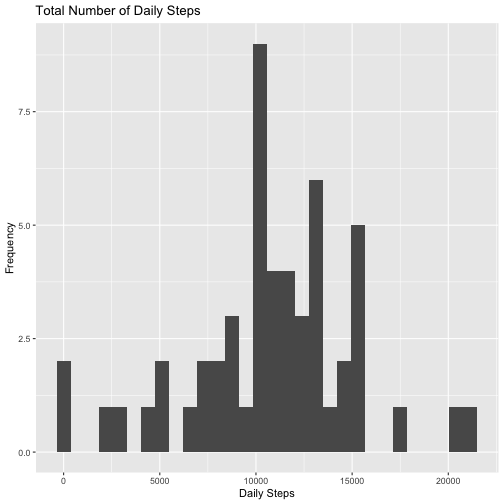
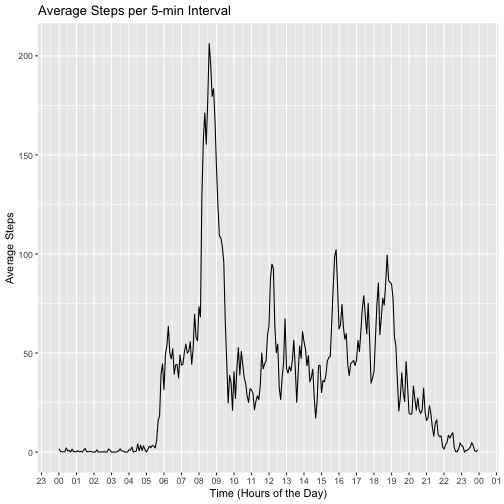
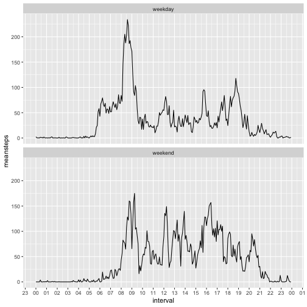
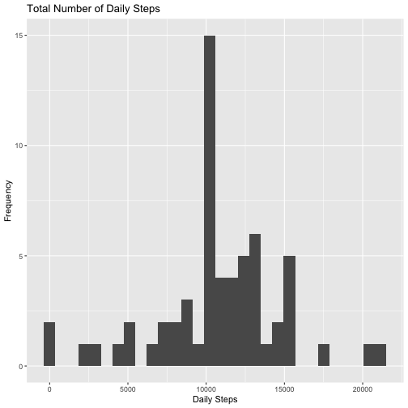

## Purpose and Data
This assignment makes use of data from a personal activity monitoring device. This device collects data at 5 minute intervals through out the day. The data consists of two months of data from an anonymous individual collected during the months of October and November, 2012 and include the number of steps taken in 5 minute intervals each day.

The data for this assignment can be downloaded from [the course web site](https://d396qusza40orc.cloudfront.net/repdata%2Fdata%2Factivity.zip).

## Loading and Processing Data

Assume that we have downloaded and unzipped the data file to the current working  directory as "activity.csv". The code below load the data into R and do some data processing as follow:

- read "activity.csv using read.csv()
- format the "date" variable into date format
- for the "interval" variable, transform to date format. In this way the plot using interval will show up correctly in minutes and hours


```r
#This assumes the data "activity.csv" was loaded in the working directory
library(tidyverse)
library(lubridate)

setwd("~/Documents/R Course/Reproducible Research/Week 2")

actdata <- read.csv("activity.csv", )

#change date column to date format
actdata$date <- as.Date(actdata$date, "%Y-%m-%d")

#convert interval to time for better presentation
#convert interval by adding leading zeros and colon ":"

actdata$interval <- sprintf("%04d",actdata$interval)
actdata$interval <- gsub("(\\d{2})(\\d{2})", "\\1:\\2", actdata$interval)

#convert to time format,setting the day arbitrarily to 2012-10-01

actdata$interval <- as.POSIXct(paste0("2012-10-01",actdata$interval))
```

There are 8 dates with NA in steps and for those 8 dates, there are only NA
entries. This is around 13% of the data, but as there are no additional info
to impute the data or patterns of occurences of NA entries, we will leave out the
NA dates from below analysis for the moment. We will return to these NA entries in later section.

## Mean Total of the Number of Steps per day

After the reading the data into R and the above processing, it is easy to compute the total number of steps taken each date by summarizing the data frame actdata and group by the "date" variable:


```r
#sum steps by date

actdaily <- actdata %>% group_by(date) %>% 
  summarize(dailysteps=sum(steps, na.rm=FALSE))
```

Below is a histogram of the daily steps:




Note that there is a warning corresponding to the 8 NA dates, as mentioned before we will deal with this in later section. 

Ignoring the NA entries, one can easily obtain the mean number of daily steps as 10,766.19 while the median daily steps being 10,765.


## Average Daily Activity Pattern

Similar to computing the number of steps per day, one can use the summarize() function and then group by interval to compute the average number of steps of each 5-minutes interval. It is then easy to make a time series plot:


```r
#compute mean steps by interval

actint <- actdata %>% group_by(interval) %>% 
  summarize(avgsteps=mean(steps, na.rm=TRUE))


#make a time series plot using line plot

g2 <- ggplot(data=actint, aes(x=interval, y=avgsteps)) + 
  geom_line() + 
  ggtitle("Average Steps per 5-min Interval") + 
  scale_x_datetime(date_labels="%H", date_breaks = "1 hours") +
  xlab("Time (Hours of the Day)") + ylab("Average Steps")

print(g2)
```




The maximum number of steps, averaged across all days of the dataset, is 206.1698, and the corresponding time interval is the 5-minutes interval starting 08:35.  

## Imputing Missing Values

For imputing the missing values, let's jump ahead a bit to what we will be doing in the next section, and take a look at the average number of steps for weekdays comparing to weekend. The reason is that while there are a lot of ways to impute the missing values, it would intuitively yield better result if this was done consistent with the property of the underlying data. The activity of weekdays are most probably different from that of weekends.

First we perform some analysis of the NA entriee:

- housekeeping checks that there are no NA entries in the variables "date" and "interval"
- checked that only 8 dates have NA entries
- the "steps" in these 8 dates are all NA, i.e., for any particular date, either there are records of steps for the whole day, or there is no record for the whole day.


```r
#Analysis on the NA elements

sum(is.na(actdata$date))
```

```
## [1] 0
```

```r
sum(is.na(actdata$interval))
```

```
## [1] 0
```

```r
#both are zeros, no NA in the date and interval columns

natemp <- actdata$date[is.na(actdata$steps)]
nadate <- unique(natemp)
naobs <- length(natemp)

#only 8 dates have NAs. Now check that all steps entries in these days are NA
naindate <-  sum(1-is.na(actdata$steps[actdata$date %in% nadate]))
```
Some quick checks on the dates with NA shows that there is no particular pattern of date with no records. 2 days fall in Oct and the rest on Nov, and there is no particular pattern on the day of the week. 

The following code insert "weekday / weekend" as a new factor variable and compute the mean and median.

```r
#insert weekday / weekend factor variable in actdata, and make it a factor
wkend <- c("Saturday","Sunday")
actdata$weekdayweekend <- ifelse(weekdays(actdata$date) %in% wkend, 
                                 "weekend","weekday")
actdata$weekdayweekend <- as.factor(actdata$weekdayweekend)

#now compute the mean and median steps for each time interval, sort by weekday
#& weekend

actwkday <- actdata %>% group_by(weekdayweekend, interval) %>% 
  summarize(meansteps=mean(steps, na.rm=TRUE),
            mediansteps=median(steps, na.rm=TRUE))

#make a plot of the means

g3 <- ggplot(data=actwkday, aes(x=interval, y=meansteps)) +
  geom_line() +
  scale_x_datetime(date_labels="%H", date_breaks = "1 hours") +
  facet_wrap(~weekdayweekend, ncol=1)

print(g3)
```



As expected the pattern of weekday vs weekend in terms of average no of steps on each 5 minute interval are very different. One way to impute the missing data would be to use the average steps of the corresponding 5-minutes interval, and it seems we can do slightly better if we do that by distinguishing weekday or weekend. Hence for a particular date with NA entries, we first check whether the date is a weekday or weekend, and then impute the missing values in the "steps" variable by mean of the corresponding 5-minute interval of weekday or weekend as appropriate:


```r
#Replace the NA value in corresponding time interval by the mean 
#according to weekday / weekend
actdata1 <- actdata %>% left_join(actwkday, by=c("weekdayweekend","interval"))

actdata1 <- actdata1 %>% mutate(steps = ifelse(is.na(steps),meansteps, steps))

#remove redundant columns from actwkday

actdata1 <- actdata1 %>% select(-meansteps, -mediansteps)

#sum steps by date

actdaily1 <- actdata1 %>% group_by(date) %>% 
  summarize(dailysteps=sum(steps, na.rm=FALSE))
```
The histogram of after imputing the data is as below:


```r
#Histogram for daily steps

g4 <- ggplot(data=actdaily1, aes(dailysteps)) +
  geom_histogram(bins=30) + 
  ggtitle("Total Number of Daily Steps") + 
  xlab("Daily Steps") + ylab("Frequency")

print(g4)
```




After imputing the missing value, the mean number of daily steps as 10,762.05 while the median daily steps being 10,571. This compares with the original mean and median of 10,766.19 and 10,765, respectively. The mean and median are expected to change due to the way we impute the missing values, but not by much.

## Differences in Activity Patterns Weekdays vs Weekend

In the last section we already discussed the activity patterns of weedays vs weekend. We already derived the new dataset with the imputed values, and using similar codes as in last section we can obtain similar time series plot, only this time with the new dataset:


This completes the required analysis. 

